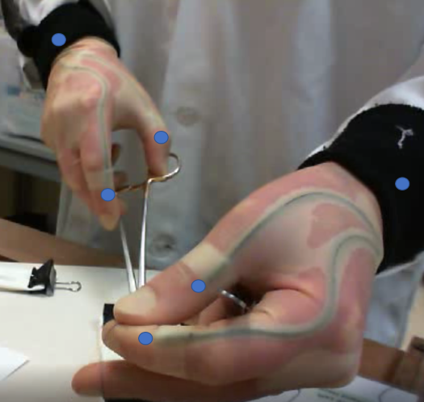

# Using-Open-Surgery-Simulation-Kinematic-Data-for-Tool-and-Gesture-Recognition (IJCARS)
A PyTorch implementation of the paper [Using-Open-Surgery-Simulation-Kinematic-Data-for-Tool-and-Gesture-Recognition](https://link.springer.com/article/10.1007/s11548-022-02615-1).



## Install
This implementation uses Python 3.6 and the following packages:
```
opencv-python==4.2.0.32
optuna==2.8.0
numpy==1.19.5
torch==1.8.1
pandas==1.1.5
wandb==0.10.33
tqdm==4.61.2
termcolor==1.1.0
```
We recommend to use conda to deploy the environment

## Dataset
[Data request](https://docs.google.com/forms/d/e/1FAIpQLSeKvalfDwLBkxh1PgrVH14wu2a8UXl7xi0bSAYEU0z9yPrdUA/viewform?usp=sf_link/)


## Run the code
To train and test the model on all the splits run:
```
python train_experiment.py
```
The visualization result is located in `summaries/APAS/experiment_name`,
Where `experiment_name` is a string describing the experiment: the network type, whether it is online, etc.

## Citation
```
@article{DBLP:journals/cars/GoldbraikhVPL22,
  author    = {Adam Goldbraikh and
               Tomer Volk and
               Carla M. Pugh and
               Shlomi Laufer},
  title     = {Using open surgery simulation kinematic data for tool and gesture
               recognition},
  journal   = {Int. J. Comput. Assist. Radiol. Surg.},
  volume    = {17},
  number    = {6},
  pages     = {965--979},
  year      = {2022},
  url       = {https://doi.org/10.1007/s11548-022-02615-1},
  doi       = {10.1007/s11548-022-02615-1},
  timestamp = {Thu, 02 Jun 2022 16:58:49 +0200},
  biburl    = {https://dblp.org/rec/journals/cars/GoldbraikhVPL22.bib},
  bibsource = {dblp computer science bibliography, https://dblp.org}
}
```
